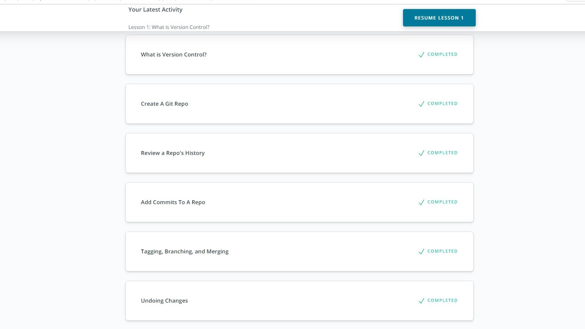
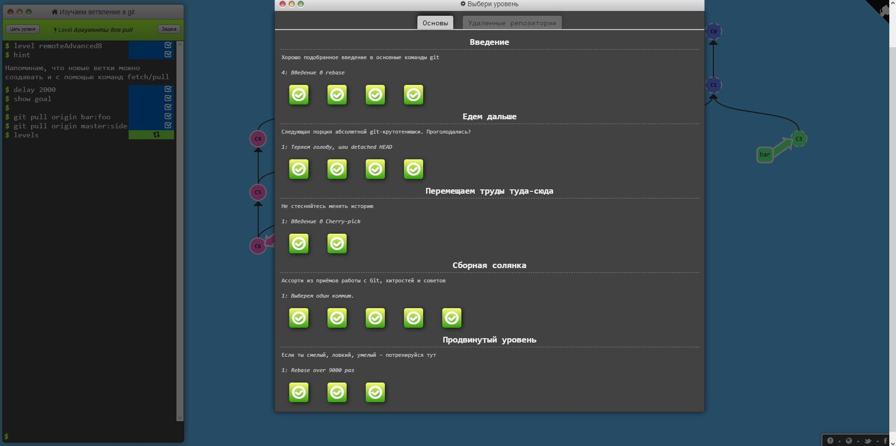
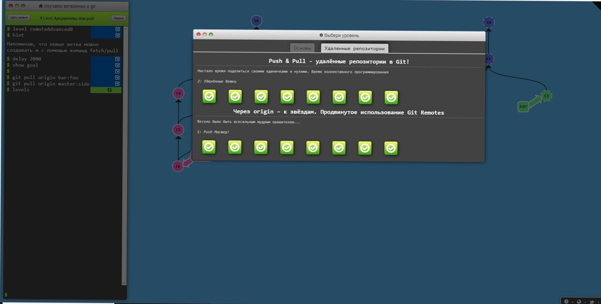

# kottans-frontend
# General
-  [X] Git Basics

## Git Basics 

## Version Control with Git 

- In this course everything was new for me, differents commands and flags and etc, because I just started learning Git. 

## Learn Git Branching 

-I improved my knowledge about Git Branching.

## Linux CLI, and HTTP

I learned information about Linux and Linux commands. 
It was my first experience with Linux, but it was not difficult.

## Git Collaboration

-One more course was passed, learned more information about Git, GitHub and about Git branching.

What was new to me:

- How works with GitHub;
- how create a pull requests;
- how working with remote repo with: git fetch, git push and git pull.

